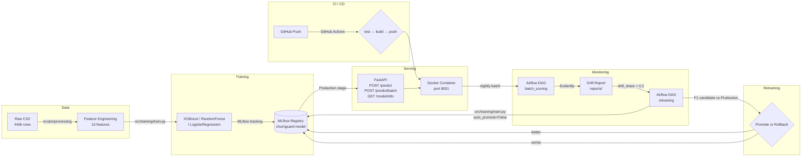

# ChurnGuard — End-to-End MLOps Pipeline

**Jedha Data Science Lead — Final Project**

ChurnGuard is a production-grade MLOps pipeline that predicts customer churn risk, exposes predictions via a REST API, and continuously monitors and retrains the model when data drift is detected.

Trained on the **muhammadshahidazeem** dataset (440k rows, Kaggle), the pipeline is designed to be retrained on real SeoLap SaaS data as soon as sufficient volume is available.

---

## Architecture



---

## Stack

| Component | Tool | Version |
|---|---|---|
| Language | Python | 3.11 |
| ML | Scikit-learn + XGBoost | ≥1.4 / ≥2.0 |
| API | FastAPI + Uvicorn | ≥0.111 |
| Model versioning | MLflow | ≥2.13 |
| Data versioning | DVC | ≥3.50 |
| Orchestration | Apache Airflow | 2.9.1 |
| Monitoring | Evidently | ≥0.4 |
| CI/CD | GitHub Actions | — |
| Containerisation | Docker Compose | — |
| Database | PostgreSQL | 15 |

---

## Prerequisites

- Docker & Docker Compose
- Python 3.11 (for local scripts outside Docker)
- DVC (for pulling data from DagsHub remote)
- Git

```bash
pip install dvc
```

---

## Quick Start

### 1. Clone the repository

```bash
git clone https://github.com/emelineroblot/churnguard.git
cd churnguard
git checkout develop
```

### 2. Pull the data

```bash
# Configure DagsHub credentials (first time only)
dvc remote modify dagshub --local auth basic
dvc remote modify dagshub --local user emelineroblot
dvc remote modify dagshub --local password <your-dagshub-token>

# Pull data and processed features
dvc pull
```

This downloads:
- `data/customer_churn_dataset-training-master.csv` (22 MB)
- `data/customer_churn_dataset-testing-master.csv` (3 MB)
- `data/processed/features_engineered.csv` (35 MB)
- `data/processed/features_engineered_test.csv` (4 MB)

### 3. Train the model (first run)

```bash
# Install dependencies (API only — avoids heavy Airflow install)
pip install -r requirements-api.txt

# Or full install
pip install -e ".[dev]"

# Run preprocessing
python -m src.preprocessing.pipeline

# Train and register the model in MLflow
python -m src.training.train
```

### 4. Start the full stack

```bash
docker compose -f docker/dev/docker-compose.yml up -d
```

Wait ~30 seconds for services to initialize, then access:

| Service | URL | Credentials |
|---|---|---|
| **ChurnGuard API** | http://localhost:8001 | — |
| **API Docs (Swagger)** | http://localhost:8001/docs | — |
| **MLflow UI** | http://localhost:5000 | — |
| **Airflow UI** | http://localhost:8080 | airflow / airflow |

### 5. Rebuild after source changes

```bash
# Rebuild API image only
docker compose -f docker/dev/docker-compose.yml up -d --build api

# Full reset (deletes all volumes)
docker compose -f docker/dev/docker-compose.yml down -v
```

---

## API Reference

Base URL: `http://localhost:8001`

### `GET /health`

Health check.

```bash
curl http://localhost:8001/health
```

```json
{"status": "ok", "model_loaded": true}
```

---

### `POST /predict`

Predict churn risk for a single account.

**Request body:**

```json
{
  "account_id": "ACC-001",
  "features": {
    "Age": 35,
    "Gender": 1,
    "Tenure": 24,
    "Usage Frequency": 15,
    "Support Calls": 3,
    "Payment Delay": 10,
    "Contract Length": 1,
    "Total Spend": 800.0,
    "Last Interaction": 7,
    "Subscription Type_Basic": 0,
    "Subscription Type_Standard": 1,
    "Subscription Type_Premium": 0,
    "support_intensity": 0.12,
    "spend_per_month": 32.0,
    "payment_risk_score": 30.0
  }
}
```

**Feature reference:**

| Feature | Type | Description |
|---|---|---|
| `Age` | int | Customer age |
| `Gender` | int | 1 = male, 0 = female |
| `Tenure` | int | Months as customer |
| `Usage Frequency` | int | Number of sessions per month |
| `Support Calls` | int | Number of support calls in the period |
| `Payment Delay` | int | Days of payment delay |
| `Contract Length` | int | 0 = Monthly, 1 = Quarterly, 2 = Annual |
| `Total Spend` | float | Total amount spent |
| `Last Interaction` | int | Days since last interaction |
| `Subscription Type_Basic` | int | 1 if Basic plan, else 0 |
| `Subscription Type_Standard` | int | 1 if Standard plan, else 0 |
| `Subscription Type_Premium` | int | 1 if Premium plan, else 0 |
| `support_intensity` | float | Support Calls / (Tenure + 1) |
| `spend_per_month` | float | Total Spend / (Tenure + 1) |
| `payment_risk_score` | float | Payment Delay × Support Calls |

**Response:**

```json
{
  "account_id": "ACC-001",
  "churn_score": 0.1823,
  "churn_risk": "low"
}
```

`churn_risk` thresholds: `low` < 0.4 ≤ `medium` < 0.7 ≤ `high`

```bash
curl -X POST http://localhost:8001/predict \
  -H "Content-Type: application/json" \
  -d '{
    "account_id": "ACC-001",
    "features": {
      "Age": 35, "Gender": 1, "Tenure": 24,
      "Usage Frequency": 15, "Support Calls": 3,
      "Payment Delay": 10, "Contract Length": 1,
      "Total Spend": 800.0, "Last Interaction": 7,
      "Subscription Type_Basic": 0,
      "Subscription Type_Standard": 1,
      "Subscription Type_Premium": 0,
      "support_intensity": 0.12,
      "spend_per_month": 32.0,
      "payment_risk_score": 30.0
    }
  }'
```

---

### `POST /predict/batch`

Score multiple accounts in a single call.

```json
{
  "accounts": [
    {"account_id": "ACC-001", "features": { ... }},
    {"account_id": "ACC-002", "features": { ... }}
  ]
}
```

**Response:**

```json
{
  "results": [
    {"account_id": "ACC-001", "churn_score": 0.1823, "churn_risk": "low"},
    {"account_id": "ACC-002", "churn_score": 0.8910, "churn_risk": "high"}
  ]
}
```

---

### `GET /model/info`

Returns metadata about the model currently in Production.

```bash
curl http://localhost:8001/model/info
```

```json
{
  "model_name": "churnguard-model",
  "version": "3",
  "stage": "Production",
  "metrics": {
    "f1_score": 0.999,
    "auc_roc": 1.0,
    "precision": 0.999,
    "recall": 0.999
  },
  "trained_at": "2025-05-18T14:32:00+00:00",
  "feature_count": 15
}
```

---

## Model Versioning & Rollback

All experiments are tracked in MLflow at http://localhost:5000.

The active model is registered as **`churnguard-model`** in the **`Production`** stage.

### Rollback to a previous version

```bash
# List available versions
python -m src.training.registry

# Rollback to version N
python -m src.training.registry rollback --version N
```

This transitions version N back to `Production` in under 5 minutes, and the API picks up the new model at next startup.

---

## Monitoring & Drift Detection

Evidently generates drift reports comparing the training distribution to current inference data.

```bash
# Check for drift (returns True if drift detected)
python -c "from src.monitoring.alert import check_drift; print(check_drift())"

# Simulate artificial drift to trigger the pipeline (demo)
python src/retraining/scripts/simulate_drift.py --noise 0.3
```

Reports are saved to `reports/` as JSON and HTML.

**Alert thresholds:**
- `drift_share > 0.2` — more than 20% of features have drifted
- F1 drop `> 0.05` — model performance degradation

---

## Automated Retraining (Airflow)

Two DAGs are available in the Airflow UI at http://localhost:8080:

| DAG | Schedule | Description |
|---|---|---|
| `batch_scoring_dag` | Daily at 02:00 | Scores all active accounts, simulates Mautic push |
| `retraining_dag` | Monday at 03:00 | Checks drift → retrains → promotes or rolls back |

### Manually trigger retraining

```bash
# Via Airflow CLI (inside the scheduler container)
docker exec -it churnguard-dev-airflow-scheduler-1 \
  airflow dags trigger retraining_dag

# Or trigger from the Airflow UI → DAGs → retraining_dag → Trigger DAG ▶
```

The retraining DAG:
1. Runs `check_drift()` — branches to `retrain` or `skip`
2. Retrains with `auto_promote=False` — registers candidate in MLflow
3. Compares candidate F1 vs current Production F1 (via XCom)
4. Promotes candidate if better, otherwise rolls back

---

## Running Tests

```bash
# API tests (mock-based, no MLflow required)
.venv313/Scripts/python.exe -m pytest tests/test_api.py -v

# Linting
.venv313/Scripts/python.exe -m ruff check src/
```

> `tests/test_preprocessing.py` is excluded from CI — it targets the legacy rivalytics schema and is pending rewrite for the muhammadshahidazeem dataset.

---

## CI/CD Pipeline

GitHub Actions workflow: `.github/workflows/ci.yml`

| Job | Trigger | Steps |
|---|---|---|
| `test` | Push to `develop`/`main`, PR to `main` | ruff lint + pytest |
| `build` | Same | Docker build + push to GHCR |
| `deploy` | Disabled (`if: false`) | To activate for Hetzner deploy |

Docker image: `ghcr.io/emelineroblot/churnguard-api:<branch>-<sha>`

---

## Project Structure

```
final-project-dslead/
├── data/
│   ├── customer_churn_dataset-training-master.csv   # Raw train (DVC)
│   ├── customer_churn_dataset-testing-master.csv    # Raw test (DVC)
│   └── processed/
│       ├── features_engineered.csv                  # Train features (DVC)
│       └── features_engineered_test.csv             # Test features (DVC)
├── notebooks/
│   └── 01_eda.ipynb                                 # EDA & exploration
├── src/
│   ├── preprocessing/       # loader → cleaner → features → pipeline
│   ├── training/            # train.py + registry.py
│   ├── api/                 # FastAPI app + Pydantic schemas
│   ├── monitoring/          # drift_report.py + alert.py
│   └── retraining/
│       ├── dags/            # batch_scoring_dag.py + retraining_dag.py
│       └── scripts/         # simulate_drift.py
├── tests/
│   └── test_api.py
├── docker/
│   ├── dev/docker-compose.yml
│   └── prod/docker-compose.yml
├── .github/workflows/ci.yml
├── Dockerfile
├── Dockerfile.mlflow
├── requirements-api.txt
└── pyproject.toml
```

---

## Dataset

**Source:** [muhammadshahidazeem/customer-churn-dataset](https://www.kaggle.com/datasets/muhammadshahidazeem/customer-churn-dataset) (Kaggle)

| Split | Rows | Churn rate |
|---|---|---|
| Train | 440,832 | 56.7% |
| Test | 64,374 | 47.4% |

**Model performance (XGBoost, v3):**

| Metric | Score |
|---|---|
| F1-score | 0.999 |
| AUC-ROC | 1.000 |
| Precision | 0.999 |
| Recall | 0.999 |

Top features by importance: Total Spend (21%) → Support Calls (18%) → Contract Length (12%) → payment_risk_score (11%) → Payment Delay (10%).

> High scores are expected on this synthetic dataset — feature distributions were generated to correlate directly with the target. The pipeline architecture is designed to retrain on real SeoLap data as it becomes available.

---

## License

MIT
