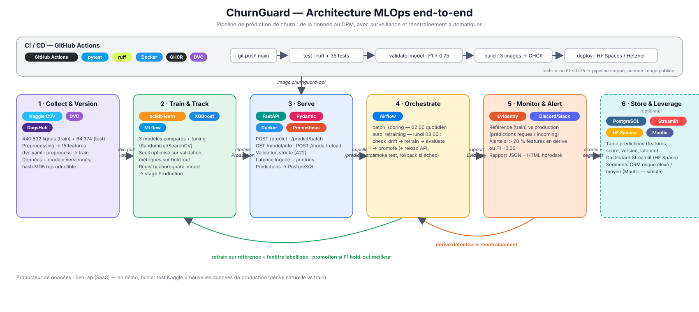
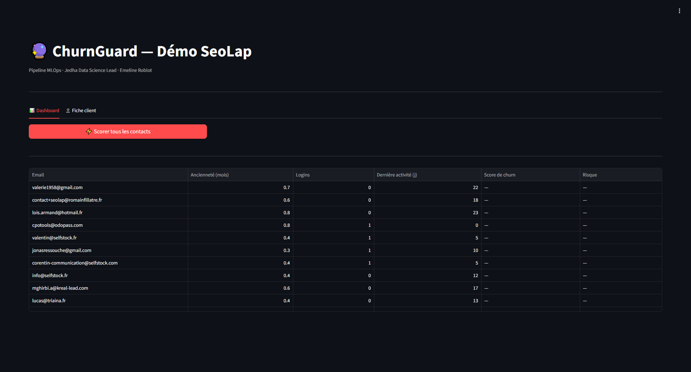
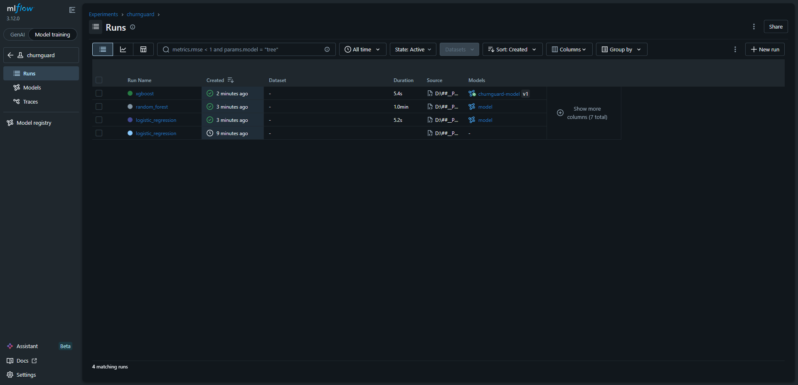
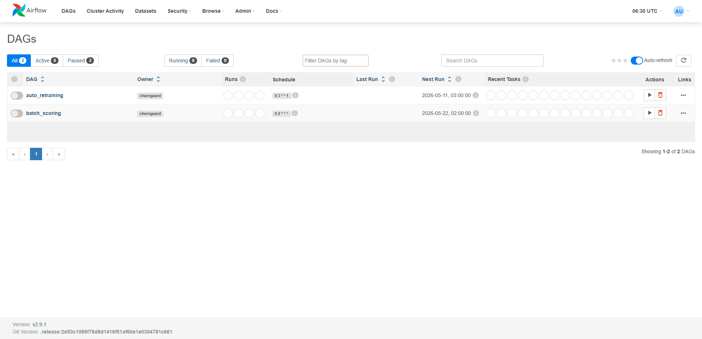
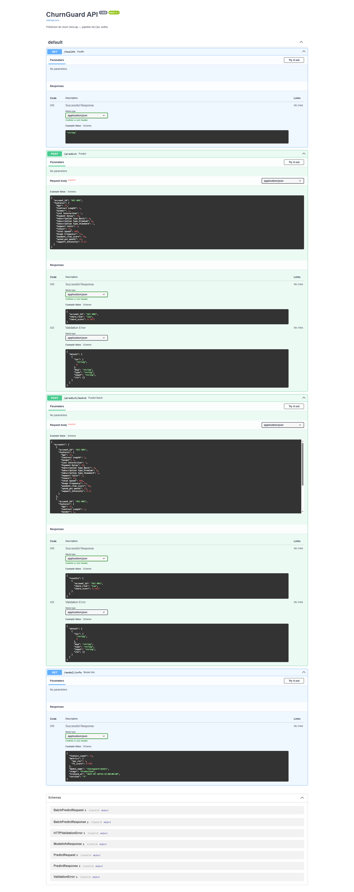
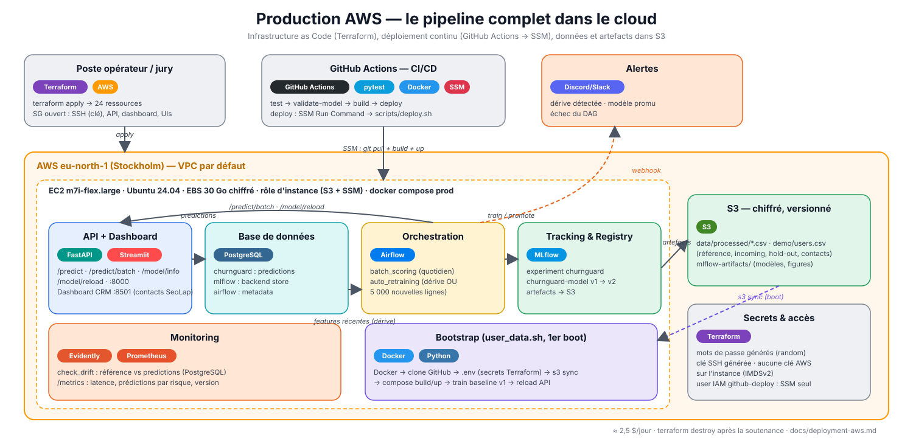

# ChurnGuard — End-to-End MLOps Pipeline

**Jedha Data Science Lead — projet final**

ChurnGuard prédit le risque de churn des comptes d'un SaaS (SeoLap), expose les scores via une API REST, **surveille la dérive des données en production et se réentraîne automatiquement** quand le modèle décroche — avec promotion ou rollback sans intervention humaine.

Entraîné sur le dataset Kaggle **muhammadshahidazeem** (440 k lignes), conçu pour être réentraîné sur les données réelles SeoLap.



> Schémas détaillés : [boucle de réentraînement](docs/architecture/02-boucle-reentrainement.svg) · [CI/CD](docs/architecture/03-cicd.svg) · [versioning & lineage](docs/architecture/04-versioning-lineage.svg) · [production AWS](docs/architecture/05-production-aws.svg) · [business case](docs/architecture/00-business-case.svg)

---

## Sommaire

1. [Ce que fait le pipeline](#ce-que-fait-le-pipeline)
2. [Résultats](#résultats)
3. [Démo en ligne](#démo-en-ligne)
4. [Quick start](#quick-start)
5. [Démo du cycle complet (dérive → réentraînement → promotion)](#démo-du-cycle-complet)
6. [API](#api)
7. [Versioning & rollback](#versioning--rollback)
8. [Monitoring & alertes](#monitoring--alertes)
9. [Orchestration Airflow](#orchestration-airflow)
10. [CI/CD](#cicd)
11. [Production AWS](#production-aws)
12. [Tests](#tests)
13. [Structure du repo](#structure-du-repo)
14. [Documentation](#documentation)

---

## Ce que fait le pipeline

| Brique | Outil | Ce qui est implémenté |
|---|---|---|
| Données | DVC + DagsHub | CSV bruts, features et modèle exporté versionnés ; `dvc.yaml` (`preprocess` → `train`) reproductible |
| Entraînement | scikit-learn, XGBoost, MLflow | 3 modèles comparés, tuning `RandomizedSearchCV`, seuil calibré sur validation, métriques sur hold-out, figures + importance des features + lineage (git sha, hash DVC) logués |
| Registry | MLflow Model Registry | `churnguard-model`, une version en `Production`, promotion / rollback en CLI ou par le DAG |
| Serving | FastAPI, Docker | `/predict`, `/predict/batch` (vectorisé), `/model/info`, `/model/reload` (à chaud), validation stricte des 15 features |
| Observabilité | Prometheus, PostgreSQL | Latence par requête (log JSON + `/metrics`), prédictions stockées en base |
| Monitoring | Evidently | Dérive référence vs production (prédictions reçues ou fenêtre labellisée), rapport horodaté, alerte Discord/Slack |
| Orchestration | Airflow | `batch_scoring` (quotidien) · `auto_retraining` (hebdo) : dérive **ou** nouvelles données → retrain → évaluation hold-out → promotion + reload API + smoke test → rollback si échec |
| CI/CD | GitHub Actions, GHCR, AWS SSM | lint + 35 tests → validation du modèle (F1 ≥ 0,75) → build de 3 images → déploiement continu sur l'EC2 AWS (+ HF Spaces via `deploy-model.yml`) |
| Production | Terraform, AWS EC2 / S3 / IAM | infrastructure as code (24 ressources), stack prod `docker/prod/` (API, MLflow, Airflow, PostgreSQL, dashboard Streamlit), données et artefacts MLflow dans S3 — [docs/deployment-aws.md](docs/deployment-aws.md) |

---

## Résultats

Le dataset Kaggle fournit un fichier train et un fichier test **qui ne suivent pas la même distribution** (9 features sur 15 en dérive selon Evidently). Plutôt que de les mélanger, le projet en fait le scénario de démo : le fichier test *est* la production qui a dérivé. Détail dans [docs/dataset-report.md](docs/dataset-report.md).

| Modèle XGBoost | Validation (même distribution) | **Hold-out** (distribution de production) |
|---|---|---|
| v1 — entraîné sur la référence seule | F1 0,999 | **F1 0,657** · AUC 0,735 (prédit presque tout en churn) |
| v5 — réentraîné par le DAG `auto_retraining` (référence 100 k + fenêtre récente, seuil calibré sur la fenêtre) | F1 0,97 | **F1 0,978** · AUC 0,995 |

C'est exactement ce que le pipeline automatise : détecter la dérive, réentraîner sur la fenêtre labellisée, promouvoir uniquement si le hold-out s'améliore. Comparaison des 3 algorithmes, tuning et justification du choix : [docs/model-card.md](docs/model-card.md).

Latence API mesurée sur la stack Docker (`python scripts/bench_latency.py`) : **p95 = 59 ms** sur `/predict` (200 requêtes), **1 000 comptes en 110 ms** via `/predict/batch` (≈ 9 000 comptes/s). Rollback + rechargement de l'API : 6 s.

---

## Démo en ligne

| Service | HuggingFace Space |
|---|---|
| API (Swagger) | https://huggingface.co/spaces/EmelineR/churnguard |
| Dashboard Streamlit (CRM SeoLap simulé) | https://huggingface.co/spaces/EmelineR/churnguard-demo |
| MLflow (runs + registry, lecture seule) | https://huggingface.co/spaces/EmelineR/churnguard-mlflow |
| Airflow (DAGs, vitrine — ne pas déclencher) | https://huggingface.co/spaces/EmelineR/churnguard-airflow |

Les Spaces MLflow et Airflow sont des vitrines sans exécution (pas de worker, base SQLite). Le cycle complet s'exécute sur la stack Docker locale ci-dessous.

| Streamlit | MLflow | Airflow | Swagger |
|---|---|---|---|
|  |  |  |  |

---

## Quick start

Prérequis : Docker Desktop, Python 3.11+, Git. DVC est installé avec les dépendances.

```bash
git clone https://github.com/emelineroblot/jedha-final-projet-dslead.git
cd jedha-final-projet-dslead
python -m venv .venv && source .venv/bin/activate   # Windows : .venv\Scripts\activate
pip install -r requirements-api.txt dvc evidently==0.7.21 pytest ruff
```

### 1. Récupérer les données (DVC → DagsHub)

```bash
dvc remote modify dagshub --local auth basic
dvc remote modify dagshub --local user <user-dagshub>
dvc remote modify dagshub --local password <token-dagshub>
dvc pull
```

Télécharge les CSV bruts (25 MB), les features (`features_engineered.csv`, `features_incoming.csv`, `features_engineered_test.csv`) et `model_artifacts/` (modèle exporté). Sans accès DagsHub : télécharger les 2 CSV sur Kaggle dans `data/` puis `dvc repro preprocess`.

### 2. Lancer la stack

```bash
docker compose -f docker/dev/docker-compose.yml up -d --build
```

> Réseau avec inspection TLS (antivirus type Avast, proxy d'entreprise) : `pip` échoue dans les conteneurs avec `CERTIFICATE_VERIFY_FAILED`. Copier `docker/dev/docker-compose.override.yml.example` en `docker-compose.override.yml` et ajouter `-f docker/dev/docker-compose.override.yml` aux commandes compose (build-arg `PIP_TRUSTED_HOST`).

| Service | URL | Identifiants |
|---|---|---|
| API + Swagger | http://localhost:8001/docs | — |
| Métriques Prometheus | http://localhost:8001/metrics | — |
| MLflow | http://localhost:5000 | — |
| Airflow | http://localhost:8080 | airflow / airflow |
| PostgreSQL | localhost:5432 | churnguard / churnguard (bases `churnguard`, `mlflow`, `airflow`) |

> Port **8001** pour l'API (8000 est utilisé par SeoLap sur la machine de dev).

### 3. Entraîner et promouvoir un premier modèle

```powershell
$env:MLFLOW_TRACKING_URI = "http://localhost:5000"     # bash : export MLFLOW_TRACKING_URI=http://localhost:5000
python -m src.training.train                            # 3 modèles → meilleur promu en Production si F1 ≥ 0.70
python -m src.training.registry list
curl -X POST http://localhost:8001/model/reload         # l'API charge la version Production
```

Le premier entraînement (référence seule) donne F1 ≈ 0,66 sur le hold-out : **sous le seuil de promotion**, il est enregistré sans être promu. Pour simuler l'état « modèle en prod qui a dérivé » : `python -m src.training.registry promote --run-id <run_id>`.

Tuning optionnel (écrit `src/training/best_params.json`, repris par `train.py`) :

```bash
python -m src.training.tuner --sample 100000 --n-iter 20 --cv 3
```

---

## Démo du cycle complet

```bash
# 1. (optionnel) amplifier la dérive naturelle — sinon features_incoming.csv suffit
python -m src.retraining.scripts.simulate_drift --noise 0.3

# 2. Contrôle de dérive : rapport Evidently + verdict (reports/drift_report.html)
python -m src.monitoring.alert
#   → {"drifted": true, "reason": "60% des features en dérive (seuil 20%)", ...}

# 3. Déclencher le DAG de réentraînement (ou bouton ▶ dans l'UI Airflow)
docker compose -f docker/dev/docker-compose.yml exec airflow-scheduler airflow dags trigger auto_retraining

# 4. Suivre : Airflow → auto_retraining (check_drift → retrain_model → evaluate_model → decide → promote_model)
#            MLflow  → nouvelle version en Production, l'ancienne archivée
#            API     → GET /model/info : version + decision_threshold mis à jour (reload automatique)
curl http://localhost:8001/model/info
```

Rollback manuel en moins d'une minute :

```bash
python -m src.training.registry rollback --version 1
curl -X POST http://localhost:8001/model/reload
```

Alertes : définir `ALERT_WEBHOOK_URL` (webhook Discord ou Slack) dans `docker/dev/.env` — dérive détectée, réentraînement déclenché, promotion, rollback et échecs de DAG sont notifiés.

---

## API

Documentation complète : [docs/api.md](docs/api.md) · Swagger : http://localhost:8001/docs

```bash
curl -X POST http://localhost:8001/predict -H "Content-Type: application/json" -d '{
  "account_id": "ACC-001",
  "features": {"Age": 35, "Gender": 1, "Tenure": 24, "Usage Frequency": 15, "Support Calls": 3,
               "Payment Delay": 10, "Contract Length": 1, "Total Spend": 800.0, "Last Interaction": 7,
               "support_intensity": 0.12, "spend_per_month": 32.0, "payment_risk_score": 30.0,
               "Subscription Type_Basic": 0, "Subscription Type_Premium": 0, "Subscription Type_Standard": 1}
}'
# {"account_id":"ACC-001","churn_score":0.1823,"churn_risk":"low","churn_predicted":false,"model_version":"2"}
```

| Endpoint | Rôle |
|---|---|
| `GET /health` | Liveness + version du modèle |
| `POST /predict` | Score d'un compte (`churn_score`, bande `churn_risk`, `churn_predicted` au seuil du modèle) |
| `POST /predict/batch` | Jusqu'à 5 000 comptes, une seule passe `predict_proba` |
| `GET /model/info` | Version, métriques hold-out, seuil de décision, features attendues |
| `POST /model/reload` | Recharge la version `Production` sans redémarrage |
| `GET /metrics` | Prometheus : latence par endpoint, volume par niveau de risque, version servie |

Feature manquante, inconnue ou hors bornes → `422` détaillé (schéma Pydantic typé). Modèle absent → `503`.

---

## Versioning & rollback

- **Données** : DVC, remote DagsHub (`https://dagshub.com/emelineroblot/churnguard.dvc`). `dvc.yaml` décrit `preprocess` → `train` ; `dvc repro` ne rejoue que ce qui a changé.
- **Modèles** : MLflow Registry `churnguard-model`. Chaque run logue hyperparamètres, métriques (validation + hold-out), seuil, signature, matrice de confusion, ROC, importance des features, et les tags `git_sha`, `data_dvc_md5`, `extra_data`, `threshold_calibrated_on`.
- **Artefact standalone** : `python -m src.training.export_model` → `model_artifacts/` (tracké DVC), utilisé par la CI et le Space HF sans serveur MLflow.

```bash
python -m src.training.registry list                    # versions, stage, F1, date
python -m src.training.registry promote --run-id <id>   # enregistre + Production (archive l'ancienne)
python -m src.training.registry rollback --version N    # remet N en Production
```

Le rollback est aussi **automatique** dans le DAG : après promotion, l'API est rechargée et testée ; si le smoke test échoue, la version précédente revient en Production et une alerte critique est envoyée.

---

## Monitoring & alertes

`src/monitoring/alert.py` génère **à chaque appel** un rapport Evidently (JSON + HTML, copie horodatée dans `reports/history/`) en comparant la référence (échantillon du train) aux données courantes, choisies dans l'ordre :

1. chemin explicite (`--current`),
2. **prédictions réellement reçues par l'API** (table `predictions`, 7 derniers jours, si ≥ 100 lignes),
3. `features_drifted.csv` (dérive amplifiée pour la démo),
4. `features_incoming.csv` (nouvelles données labellisées).

Seuils : `share_of_drifted_columns > 0.2` ou chute de F1 `> 0.05` (quand labels et scores sont disponibles). Alerte via webhook (`ALERT_WEBHOOK_URL`) + log.

Latence : header `X-Process-Time-Ms`, log JSON par requête, histogramme Prometheus `churnguard_prediction_latency_ms`.

---

## Orchestration Airflow

| DAG | Schedule | Étapes |
|---|---|---|
| `batch_scoring` | `0 2 * * *` | charge les comptes actifs → `/predict/batch` par lots de 500 → segments CRM (Mautic simulé) → résumé notifié |
| `auto_retraining` | `0 3 * * 1` | `check_drift` (Evidently **ou** ≥ 5 000 nouvelles lignes) → `retrain_model` (référence 100 k + fenêtre récente, `auto_promote=False`) → `evaluate_model` (F1 hold-out, chaque modèle à son seuil) → `decide` → `promote_model` (+ `/model/reload` + smoke test + rollback) ou `keep_current` |

Les tâches n'échangent que des scalaires par XCom ; les données passent par les volumes montés (`CHURNGUARD_ROOT=/opt/airflow`). L'image `Dockerfile.airflow` embarque MLflow, XGBoost, scikit-learn et Evidently.

Variables : `MLFLOW_TRACKING_URI`, `CHURNGUARD_API_URL`, `DATABASE_URL`, `ALERT_WEBHOOK_URL`, `RETRAIN_REFERENCE_ROWS` (100 000), `NEW_DATA_MIN_ROWS` (5 000), `BATCH_SAMPLE_SIZE` (500 en démo, 0 = tous).

---

## CI/CD

`.github/workflows/ci.yml` (push / PR sur `main`) :

| Job | Contenu | Bloque si |
|---|---|---|
| `test` | `ruff check src/ tests/` + `pytest tests/` (API, preprocessing, monitoring, training) | lint ou test rouge |
| `validate-model` | `dvc pull model_artifacts` puis F1 ≥ 0,75 sur `tests/fixtures/sample_test.csv` (500 lignes hold-out) | F1 insuffisant — ignoré avec warning si les secrets DagsHub sont absents |
| `build` | 4 images (`churnguard-api`, `churnguard-mlflow`, `churnguard-airflow`, `churnguard-dashboard`) → GHCR, tags `main` + `main-<sha>` | — |
| `deploy` | SSM Run Command → `scripts/deploy.sh` sur l'EC2 AWS (git reset `main`, `compose build`, `up -d`, reload API) | ignoré avec warning si les secrets AWS sont absents (infra détruite hors soutenance) |

`.github/workflows/deploy-model.yml` (manuel ou tag `model-v*`) : pull du modèle (DVC) → validation → bundle → push sur le Space HF `churnguard-api`. Ce workflow déploie une **mise à jour du modèle** indépendamment du code.

Secrets GitHub : `DAGSHUB_USER`, `DAGSHUB_TOKEN`, `HF_TOKEN` ; pour `deploy` : `AWS_ACCESS_KEY_ID`, `AWS_SECRET_ACCESS_KEY`, `AWS_REGION`, `EC2_INSTANCE_ID` (`terraform output -json github_secrets`).

---

## Production AWS



Le pipeline complet tourne sur une EC2 (eu-north-1) provisionnée par Terraform — [`infra/terraform/`](infra/terraform/) :
security group restreint à l'IP de l'opérateur, S3 chiffré/versionné (données processées + artefacts MLflow), rôle d'instance
(aucune clé AWS sur la machine), secrets générés, déploiement continu via SSM depuis GitHub Actions.

```bash
cd infra/terraform
terraform init && terraform apply     # ≈ 1 min + ≈ 15–20 min de bootstrap (build des images, entraînement baseline v1)
terraform output                      # api_url · dashboard_url · airflow_url · mlflow_url · ssh · bootstrap_log
terraform destroy                     # ≈ 2,5 $/jour sinon
```

Au premier boot, `user_data.sh` clone le dépôt, synchronise les données depuis S3, construit et lance la stack, entraîne le
modèle baseline (v1 en Production, F1 hold-out 0,690) et active les DAGs. Boucle complète mesurée sur l'EC2 : **47 s**
(dérive → réentraînement → évaluation → v2 promue et rechargée à chaud, F1 0,690 → 0,978). Détails, coût, sécurité et script vidéo : [docs/deployment-aws.md](docs/deployment-aws.md).

---

## Tests

```bash
pytest tests/ -v          # 35 tests (+ tests DAG exécutés dans le conteneur Airflow : pytest tests/test_dags.py)
ruff check src/ tests/
```

| Fichier | Couverture |
|---|---|
| `test_api.py` | endpoints, validation 422 (feature manquante / inconnue / hors bornes), batch vectorisé, reload, 503 sans modèle, `/metrics` |
| `test_preprocessing.py` | nettoyage, encodages, features dérivées, ordre des colonnes, modalité absente |
| `test_monitoring.py` | parsing Evidently (dont le piège `drift_share` = seuil, pas valeur observée), seuils, alertes webhook, store no-op |
| `test_training.py` | seuil optimal, métriques, concaténation fenêtre récente, lineage DVC, importance des features |
| `test_dags.py` | import des DAGs, tâches et dépendances (nécessite Airflow, POSIX) |

---

## Structure du repo

```
├── src/
│   ├── paths.py                 # chemins (CHURNGUARD_ROOT) partagés local / conteneurs
│   ├── preprocessing/           # loader → cleaner → features (FEATURE_COLUMNS) → pipeline (split incoming / hold-out)
│   ├── training/                # train.py · tuner.py · evaluate.py · registry.py (CLI) · validate.py · export_model.py
│   ├── api/                     # main.py (FastAPI, /metrics, reload) · schemas.py (Features typées)
│   ├── monitoring/              # drift_report.py · alert.py · notify.py (webhook) · store.py (PostgreSQL)
│   └── retraining/
│       ├── dags/                # batch_scoring_dag.py · retraining_dag.py
│       └── scripts/             # simulate_drift.py
├── tests/                       # + fixtures/sample_test.csv (500 lignes hold-out)
├── scripts/                     # bench_latency.py · deploy.sh (mise à jour de l'instance prod) · gen_diagrams.py
├── docker/dev/ · docker/prod/   # compose séparés (+ .env.example prod)
├── Dockerfile · Dockerfile.mlflow · Dockerfile.airflow · Dockerfile.dashboard · Dockerfile.hf
├── .github/workflows/           # ci.yml (test → validate → build → deploy SSM) · deploy-model.yml
├── infra/terraform/             # EC2 + S3 + IAM + SG (main.tf · user_data.sh · outputs.tf)
├── dvc.yaml · dvc.lock · model_artifacts.dvc · data/*.dvc
├── docs/                        # architecture/ · api.md · dataset-report.md · model-card.md · deployment-aws.md
├── notebooks/                   # 02_eda_new_dataset.ipynb (EDA dataset actif) · 01_eda.ipynb (rivalytics, archivé)
├── demo/                        # dashboard Streamlit (service `dashboard` de la stack + Space churnguard-demo)
└── screens/                     # captures de la stack
```

---

## Documentation

- [docs/dataset-report.md](docs/dataset-report.md) — dataset, EDA, preprocessing justifié, dérive train/test
- [docs/model-card.md](docs/model-card.md) — choix de l'algorithme, tuning, métriques, limites
- [docs/api.md](docs/api.md) — guide d'intégration de l'API
- [docs/deployment-aws.md](docs/deployment-aws.md) — production AWS : architecture, reproduction, coût, sécurité, script vidéo
- [docs/architecture/](docs/architecture/) — schémas (SVG)
- `notebooks/02_eda_new_dataset.ipynb` — EDA exécutée

## Périmètre exclu

Kubernetes, intégration SeoLap en production, appel Mautic réel (simulé), authentification API, interface front-end (hors démo Streamlit).

## Licence

MIT
