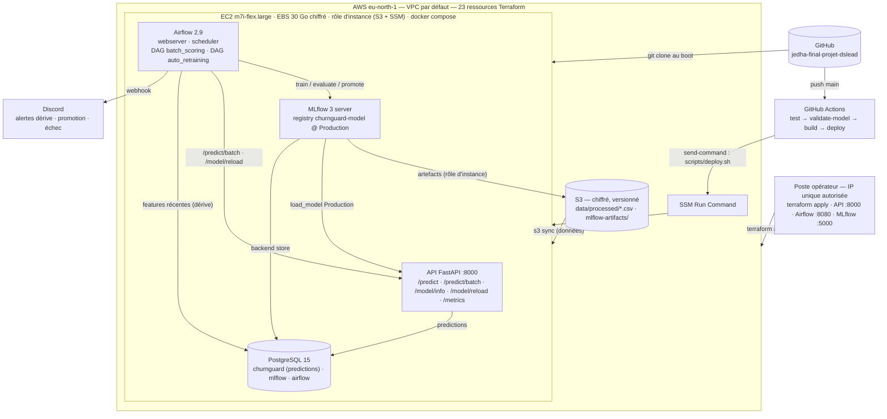

# Déploiement en production (AWS)

> Le pipeline complet tourne dans le cloud : infrastructure déclarée en **Terraform**, stack **docker compose**
> (API FastAPI, MLflow, Airflow, PostgreSQL) sur une **EC2**, données et artefacts MLflow dans **S3**,
> déploiement continu depuis GitHub Actions via **SSM**. Ce document décrit ce qui est déployé, comment le
> reproduire, ce qui diffère de la stack de développement, et ce que montre la vidéo.

- Infrastructure : [`infra/terraform/`](../infra/terraform/) (`main.tf`, `variables.tf`, `outputs.tf`, `user_data.sh`)
- Stack : [`docker/prod/docker-compose.yml`](../docker/prod/docker-compose.yml) · mise à jour : [`scripts/deploy.sh`](../scripts/deploy.sh)
- CI/CD : [`.github/workflows/ci.yml`](../.github/workflows/ci.yml) (job `deploy`)
- Région : **eu-north-1 (Stockholm)** — résidence des données UE
- Schéma : [`architecture/05-production-aws.svg`](architecture/05-production-aws.svg)

---

## 1. Architecture déployée



| Brique | Développement (`docker/dev/`) | Production (`docker/prod/` + Terraform) |
|---|---|---|
| Images | `build:` local, hot-reload (`--reload`, `src/` monté dans l'API) | **construites sur l'instance** depuis le clone (`compose build`), même tag que les images GHCR de la CI ; API 2 workers uvicorn, `restart: always` |
| PostgreSQL | conteneur, 3 bases | **même conteneur**, volume Docker sur l'EBS chiffré, mot de passe généré par Terraform. **RDS était la cible** : bloqué par le quota du plan gratuit du compte (1 instance, déjà utilisée par un autre projet) |
| Artefacts MLflow | dossier `mlruns/` monté | **S3** `mlflow-artifacts/` (`--artifacts-destination`, rôle d'instance, aucune clé) |
| Données | `data/processed/` local (DVC) | **S3** `data/processed/`, poussées par Terraform (`aws_s3_object`), synchronisées sur l'instance au boot |
| Modèle initial | `python -m src.training.train` sur le poste | conteneur Airflow, une fois au boot : 3 modèles comparés sur la référence, le meilleur promu **v1** Production (F1 hold-out ≈ 0,66 — la dérive train/production est réelle), puis `POST /model/reload` |
| DAGs | déclenchement manuel | `batch_scoring` actif (un run au boot alimente `predictions`) ; `auto_retraining` **en pause** — déclenché à la main pour la démo (P38) |
| Secrets | `.env` écrit à la main | **générés par Terraform** (`random_password`), écrits dans `/opt/churnguard/docker/prod/.env` (`chmod 600`) |
| Accès | `localhost` | security group restreint à **l'IP publique de l'opérateur** (22, 8000, 5000, 8080) |
| Mise à jour du code | rebuild manuel | **job CI `deploy`** : SSM → `scripts/deploy.sh` (git reset sur `main`, build, `up -d`, reload API) |

## 2. Ce que fait `user_data.sh` au premier démarrage

1. Installe Docker, compose, AWS CLI v2.
2. Clone le dépôt (`repo_ref`, défaut `main`) dans `/opt/churnguard`.
3. Écrit `docker/prod/.env` avec les secrets Terraform (Postgres, admin Airflow, secret key, webhook Discord, bucket S3).
4. `aws s3 sync` des données processées (référence 440 k lignes, fenêtre incoming, hold-out).
5. `docker compose build && up -d` (prod) — le conteneur Postgres crée les 3 bases au premier démarrage.
6. Quand MLflow répond : `compose run airflow-scheduler python -m src.training.train` → LogReg / RF / XGBoost comparés, le meilleur enregistré **v1** et promu `Production` (≈ 10 min sur 2 vCPU).
7. `POST /model/reload` : l'API (démarrée sans modèle, `/predict` en 503) charge v1.
8. Quand Airflow répond : dépause de `batch_scoring` (un run immédiat : 500 comptes scorés → table `predictions`).

Journal : `/var/log/churnguard-bootstrap.log` (commande dans `terraform output bootstrap_log`).

## 3. Reproduire

Prérequis : compte AWS avec droits EC2, S3, IAM ; CLI AWS configurée ; Terraform ≥ 1.5 ; `data/processed/*.csv` présents (`dvc pull` ou `dvc repro`).

```bash
cp infra/terraform/terraform.tfvars.example infra/terraform/terraform.tfvars   # alert_webhook_url (optionnel)
cd infra/terraform
terraform init
terraform apply                         # ≈ 1 min, puis ≈ 15–20 min de bootstrap sur l'EC2
terraform output                        # api_url, airflow_url, mlflow_url, ssh, bootstrap_log, s3_bucket
terraform output -raw airflow_login
terraform output -json github_secrets   # AWS_ACCESS_KEY_ID, AWS_SECRET_ACCESS_KEY, AWS_REGION, EC2_INSTANCE_ID → secrets GitHub
```

**Déploiement continu** : une fois les 4 secrets ajoutés dans GitHub (Settings → Secrets → Actions), chaque push sur `main`
qui passe `test` et `validate-model` exécute `scripts/deploy.sh` sur l'instance via SSM Run Command (`AWS-RunShellScript`).
L'user IAM `churnguard-github-deploy` ne peut que `ssm:SendCommand` sur cette instance — aucun port SSH n'est ouvert aux runners.
Sans secrets, le job est ignoré avec un avertissement. À la main : `terraform output -raw ssh` puis `sudo bash /opt/churnguard/scripts/deploy.sh main`.

**Arrêt** : `terraform destroy` — supprime les 23 ressources, bucket inclus (`force_destroy`).

Pause sans détruire (données conservées sur l'EBS, ~0,1 $/jour) : `aws ec2 stop-instances --instance-ids $(terraform output -raw instance_id)` ;
l'IP publique change au redémarrage (`terraform refresh` puis `output`). Si l'IP de l'opérateur change : `terraform apply` met à jour le security group.

## 4. Coût

| Ressource | Tarif eu-north-1 | Par jour |
|---|---|---|
| EC2 `m7i-flex.large` (2 vCPU, 8 Go) | ~0,10 $/h | ~2,4 $ |
| EBS 30 Go gp3 | ~0,09 $/Go/mois | ~0,1 $ |
| S3 (< 100 Mo, versionné) | — | < 0,01 $ |
| SSM Run Command | gratuit | — |
| **Total** | | **≈ 2,5 $/jour** — à détruire après la soutenance |

## 5. Sécurité du déploiement

- Aucune clé AWS dans le code ni sur l'instance : S3 est accédé via le **rôle d'instance** (IMDSv2, `hop_limit = 2` pour que les conteneurs MLflow/Airflow y accèdent).
- Mots de passe Postgres et Airflow, secret key Airflow **générés** par Terraform, stockés dans l'état local (gitignoré) et dans `.env` sur l'instance.
- Clé SSH générée par Terraform → `infra/terraform/keys/` (gitignoré). Clés du user `github-deploy` uniquement dans l'état Terraform et les secrets GitHub.
- Security group : tout est fermé sauf l'IP de l'opérateur ; les runners GitHub passent par SSM (canal sortant de l'agent), pas par SSH.
- Chiffrement at-rest : volume EC2 (Postgres inclus), S3 (AES-256) ; versioning S3 ; bucket privé.
- Limites assumées : UIs et API en HTTP (pas de TLS, pas de domaine) ; base non managée (pas de sauvegarde automatique — snapshot EBS ou RDS en cible) — acceptable pour une démo restreinte à une IP, pas pour une vraie production (reverse proxy TLS, RDS privé, Secrets Manager, auth sur l'API).

## 6. Pièges rencontrés

- **MLflow 3 + S3** : le serveur renvoie des URLs présignées au client pour le téléchargement des artefacts → `MLFLOW_S3_ENDPOINT_URL=https://s3.<région>.amazonaws.com` obligatoire (sinon `SignatureDoesNotMatch` côté API/Airflow alors que l'upload passe).
- **MLflow 3 + Host** : `--allowed-hosts *` sinon `403 Invalid Host header` depuis `http://mlflow:5000` (P37).
- **Airflow UID 50000** : `src/` et `data/` montés depuis le clone doivent être `chown 50000:0` (bootstrap et `deploy.sh`).
- **`compose run --no-deps`** pour l'entraînement baseline : le scheduler dépend de l'API « healthy », l'API démarre sans modèle → l'entraînement ne doit pas attendre la chaîne de dépendances.
- **Dépauser un DAG hebdo** lance immédiatement le dernier intervalle manqué (P38) → `auto_retraining` reste en pause, `airflow dags trigger` pendant la démo.
- **`user_data` = premier boot uniquement** (`lifecycle.ignore_changes`) : les mises à jour passent par `deploy.sh` ; pour repartir de zéro, `terraform apply -replace=aws_instance.app`.

## 7. Ce que la vidéo montre (script, ≈ 3 min)

1. Console AWS ou `terraform output` : l'instance `churnguard-app`, le bucket S3 (`data/processed/`, `mlflow-artifacts/`).
2. API (`http://<ip>:8000/docs`) : `GET /model/info` → **v1**, F1 hold-out ≈ 0,66 ; `POST /predict` sur un compte à risque.
3. MLflow (`http://<ip>:5000`) : l'expérience `churnguard` (3 runs baseline), le registry `churnguard-model` v1 Production, les artefacts dans S3.
4. Airflow (`http://<ip>:8080`) : `batch_scoring` vert (500 comptes), puis **trigger `auto_retraining`** → `check_drift` (9/15 features en dérive) → `retrain_model` → `evaluate_model` → `promote_model` (≈ 2 min).
5. Discord : alerte de dérive puis notification de promotion **v2** (F1 hold-out ≈ 0,98).
6. Retour API : `GET /model/info` → **v2** sans redémarrage ; MLflow : v1 archivée.
7. GitHub Actions : le run du dernier push sur `main` avec le job `deploy` vert (SSM).
